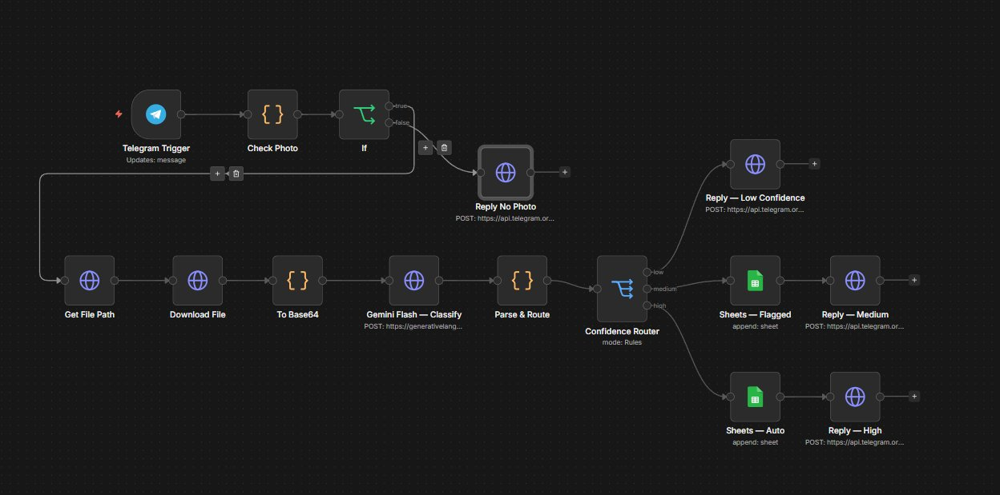

<div align="center">

# 🧾 DocFlow AI

### AI-Powered Thai Business Document Intelligence Pipeline

[](https://n8n.io)
[](https://aistudio.google.com)
[](https://docker.com)
[](https://core.telegram.org/bots)
[](LICENSE)
[](/)

<br/>

**Send a slip → AI reads it → Data appears in Google Sheets. Automatically.**

*No manual entry. No silent errors. The AI knows when it's not sure.*

<br/>



</div>

---

## 🎯 The Problem This Solves

Every day, businesses receive dozens of bank slips, invoices, and receipts via LINE or Telegram. Someone has to manually read each one and enter the data into a spreadsheet. It's slow, error-prone, and soul-crushing work.

**DocFlow AI eliminates this entirely.**

---

## ✨ What Makes This Different

Most n8n document bots work like this: `Send image → OCR → Write to sheet`

They fail silently. If the AI misreads ฿1,500 as ฿15,000, it writes the wrong number and nobody knows.

**DocFlow AI is self-aware.** It scores its own confidence and routes accordingly:

<div align="center">

| Confidence Score | What Happens |
|:---:|---|
| 🔴 **< 60%** | Asks user to resend a clearer image |
| 🟡 **60 – 85%** | Logs to Sheets + flags for human review |
| 🟢 **> 85%** | Auto-logs instantly + sends confirmation reply |

</div>

> **Zero silent errors.** The system escalates when uncertain instead of quietly writing bad data.

---

## 📱 Demo

```
User:  [sends photo of bank slip]

Bot:   ✅ บันทึกแล้วอัตโนมัติ

       📄 ประเภท: slip
       💰 ยอด: 553.40 THB
       👤 จาก: นาย จักรพรรดิ์ กิ่งทอง
       🏦 ธนาคาร: กสิกรไทย
       🔢 เลขอ้างอิง: DMPP2605100332050
       🕐 เวลา: 10 พ.ค. 2569 16:32
       🎯 confidence: 91%
```

---

## 🏗️ Architecture

```
┌─────────────────────────────────────────────────────────────┐
│                        USER                                  │
│                  sends photo via Telegram                    │
└──────────────────────────┬──────────────────────────────────┘
                           │
                           ▼
┌─────────────────────────────────────────────────────────────┐
│                    TELEGRAM BOT API                          │
│              webhook → ngrok → localhost:5678                │
└──────────────────────────┬──────────────────────────────────┘
                           │
                           ▼
┌─────────────────────────────────────────────────────────────┐
│                   n8n ORCHESTRATOR                           │
│                   (self-hosted, Docker)                      │
│                                                             │
│  ① Telegram Trigger    → receives message                   │
│  ② Check Photo         → validates image exists             │
│  ③ Get File Path       → fetches Telegram file URL          │
│  ④ Download File       → downloads binary image             │
│  ⑤ To Base64           → converts for API                   │
│  ⑥ Gemini Flash 2.0   → classify + extract + score          │
│  ⑦ Parse & Route       → reads confidence score             │
│  ⑧ Confidence Router   → splits into 3 paths                │
└────────────┬───────────────────────┬───────────────-─────---┘
             │                       │                    │
    confidence < 60%        60% – 85%              > 85%
             │                       │                    │
             ▼                       ▼                    ▼
      ┌─────────┐           ┌──────────────┐      ┌───────────┐
      │ Ask to  │           │ Sheets +     │      │   Auto    │
      │ resend  │           │ Flag Review  │      │   Log     │
      └─────────┘           └──────────────┘      └───────────┘
                                    │                    │
                                    └─────────┬──────────┘
                                              │
                                              ▼
                                   ┌──────────────────┐
                                   │  Google Sheets   │
                                   │  + Telegram reply│
                                   └──────────────────┘
```

---

## 📄 Document Types Supported

| Type | Thai Name | Fields Extracted |
|---|---|---|
| `slip` | สลิปโอนเงิน | Amount, Bank, Sender, Receiver, Ref No., DateTime |
| `invoice` | ใบแจ้งหนี้ / ใบกำกับภาษี | Amount, Vendor, Due Date, Ref No. |
| `receipt` | ใบเสร็จรับเงิน | Amount, Merchant, DateTime, Ref No. |
| `purchase_order` | ใบสั่งซื้อ | Amount, Items, Vendor, PO Number |

---

## 💰 Cost Breakdown

| Component | Plan | Cost |
|---|---|---|
| Google Gemini Flash 2.0 | Free tier (1,500 req/day) | **$0** |
| n8n | Self-hosted on your machine | **$0** |
| ngrok | Free tier (1 tunnel) | **$0** |
| Google Sheets | Free | **$0** |
| **Total** | | **$0 / month** |

> Paid estimate: 10,000 documents/day ≈ **$2–3/month** (Gemini Flash pricing)

---

## 🗂️ Google Sheets Structure

Data is automatically logged to your sheet with these columns:

| Timestamp | Type | Status | Confidence | Amount | Currency | Sender | Receiver | Bank | DateTime | RefNumber | Description | ChatID | ExtractionNotes | RawJSON |
|---|---|---|---|---|---|---|---|---|---|---|---|---|---|---|

**Status values:**
- `auto` — high confidence, logged without review
- `flagged` — medium confidence, needs human check
- `needs_review` — low confidence, user asked to resend

---

## 🚀 Quick Setup (45 minutes)

### Prerequisites
- Docker Desktop installed and running
- Telegram account
- Google account
- ngrok account (free at ngrok.com)

---

### Step 1 — Clone & Configure `(5 min)`

```bash
git clone https://github.com/jakkapat-kingthong/docflow-ai.git
cd docflow-ai
cp .env.example .env
```

Open `.env` and fill in your values:

```env
TELEGRAM_TOKEN=your_token_from_botfather
GEMINI_API_KEY=your_key_from_aistudio
NGROK_URL=https://xxxx.ngrok-free.app
N8N_USER=admin
N8N_PASSWORD=your_password
SHEET_ID=your_google_sheet_id
```

---

### Step 2 — Create Telegram Bot `(5 min)`

1. Open Telegram → search **@BotFather**
2. Send `/newbot` and follow prompts
3. Copy the token → paste into `.env` as `TELEGRAM_TOKEN`

---

### Step 3 — Get Gemini API Key `(3 min)`

1. Go to [aistudio.google.com/app/apikey](https://aistudio.google.com/app/apikey)
2. Click **Create API key** → select or create a project
3. Copy the key → paste into `.env` as `GEMINI_API_KEY`

---

### Step 4 — Start n8n `(5 min)`

```bash
# If running on WSL/Ubuntu with Docker:
docker compose up -d

# Verify it's running:
docker ps
```

Open your browser → `http://localhost:5678` → login with your `.env` credentials

---

### Step 5 — Open ngrok Tunnel `(5 min)`

```bash
ngrok http 5678
```

Copy the `https://xxxx.ngrok-free.app` URL → paste into `.env` as `NGROK_URL`

```bash
# Restart n8n to pick up the new URL:
docker compose restart
```

> ⚠️ Keep the ngrok terminal open. If you close it, the webhook stops working.

---

### Step 6 — Import Workflow `(2 min)`

1. Open n8n via your ngrok URL (not localhost — important for OAuth)
2. Click **+** → **Import from file**
3. Select `workflow/docflow-ai.json`
4. Click **Import**

---

### Step 7 — Configure Credentials `(10 min)`

**Telegram:**
1. Settings → Credentials → New → **Telegram API**
2. Paste your `TELEGRAM_TOKEN` → Save
3. Open **Telegram Trigger** node → assign this credential

**Google Sheets:**
1. Settings → Credentials → New → **Google Sheets OAuth2 API**
2. Click **Sign in with Google** → authorize your account
3. Save → assign to both **Sheets — Flagged** and **Sheets — Auto** nodes

---

### Step 8 — Set Up Google Sheets `(5 min)`

1. Go to [sheets.new](https://sheets.new) → create a new spreadsheet
2. Rename **Sheet1** tab to: `All Documents`
3. Paste these headers into **Row 1** (they'll spread across columns automatically):

```
Timestamp	Type	Status	Confidence	Amount	Currency	Sender	Receiver	Bank	DateTime	RefNumber	Description	ChatID	ExtractionNotes	RawJSON
```

4. Copy the **Sheet ID** from the URL:
   ```
   https://docs.google.com/spreadsheets/d/{THIS_PART}/edit
   ```
5. Open the **Sheets — Flagged** and **Sheets — Auto** nodes → paste Sheet ID into the Document field

---

### Step 9 — Go Live `(2 min)`

1. In n8n → toggle **Active** on the workflow (top right)
2. Open Telegram → find your bot → send a bank slip photo
3. Watch the data appear in Google Sheets

---

## ⚙️ Configuration

Adjust confidence thresholds in `.env`:

```env
LOW_THRESHOLD=0.60    # below this → ask to resend
HIGH_THRESHOLD=0.85   # above this → auto-log
```

After changing values:
```bash
docker compose restart
```

---

## 📁 Project Structure

```
docflow-ai/
├── 📄 README.md                  ← you are here
├── 🐳 docker-compose.yml         ← n8n container config
├── 🔒 .env.example               ← environment variables template
├── workflow/
│   └── 📋 docflow-ai.json        ← n8n importable workflow (14 nodes)
└── docs/
    ├── 📝 gemini-prompt.md       ← AI extraction prompt + engineering notes
    ├── 📊 sheets-schema.md       ← Google Sheets column spec
    └── 🖼️ workflow.png           ← workflow screenshot
```

---

## 🗺️ Roadmap

- [x] Confidence-aware routing (Low / Medium / High)
- [x] 4 document types (slip, invoice, receipt, purchase order)
- [x] Telegram Bot trigger
- [x] Google Sheets logging with audit trail
- [ ] LINE OA trigger
- [ ] Duplicate detection by reference number
- [ ] Daily summary cron → Telegram notification
- [ ] Google Looker Studio dashboard
- [ ] Confidence calibration from correction history
- [ ] Multi-language support (EN + TH)

---

## 🛠️ Tech Stack

| Layer | Technology | Purpose |
|---|---|---|
| **Orchestration** | n8n (self-hosted) | Workflow automation |
| **AI / Vision** | Google Gemini Flash 2.0 | Document classification + data extraction |
| **Storage** | Google Sheets | Structured data logging |
| **Trigger** | Telegram Bot API | Document intake via chat |
| **Tunnel** | ngrok | Expose local n8n to internet |
| **Container** | Docker Compose | Reproducible deployment |

---

## 👨‍💻 Author

<div align="center">

**Jakkapat Kingthong (เต้)**

*AI Engineer · Google Student Ambassador · Bangkok University*

🏆 Top 3 Finalist — Google Securing Digital Trust Anti-Scam Ideathon (March 2026)

[](https://github.com/jakkapat-kingthong)
[](https://linkedin.com/in/jakkapat-kingthong-35345039a)
[](https://www.notion.so/Portfilio-JAKKAPAT-KINGTHONG-2700b977f90b8009902df890c587f556)

</div>

---

<div align="center">

*Built with ☕ and n8n at 3am*

⭐ Star this repo if it helped you!

</div>
